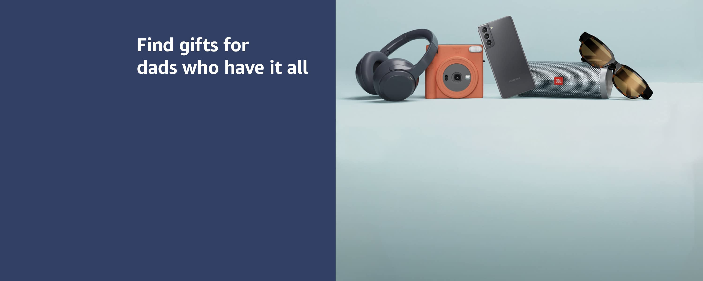

# 🛒 Amazon Clone — HTML & CSS

A pixel-perfect front-end clone of the Amazon homepage built entirely with **HTML5** and **CSS3**. This project replicates the look and feel of Amazon's UI, including the navigation bar, hero banner, product category cards, and a multi-column footer.

---

## 📸 Preview



---

## ✨ Features

- **Navigation Bar** — Amazon logo, delivery address, search bar with category dropdown, Sign-in, Returns & Orders, and Cart icon
- **Secondary Panel** — "All" hamburger menu and quick-access links (Today's Deals, Customer Service, Registry, Gift Cards, Sell)
- **Hero Section** — Full-width banner with a redirect message to Amazon India
- **Product Category Cards** — 8 category boxes (Clothes, Health & Personal Care, Furniture, Electronics, Beauty, Pet Care, Toys, Fashion)
- **Footer** — "Back to Top" bar, four-column link grid, logo divider, and copyright notice
- Responsive layout using **Flexbox** and `flex-wrap`
- Hover effects on navbar items and search bar
- External icon support via **Font Awesome 6**

---

## 🛠️ Tech Stack

| Technology | Usage |
|------------|-------|
| HTML5 | Page structure and semantics |
| CSS3 | Styling, Flexbox layout, hover effects |
| [Font Awesome 6](https://fontawesome.com/) | Icons (location pin, search, cart, copyright) |

---

## 📁 Project Structure

```
Amazon-Clone/
├── code/
│   ├── index.html      # Main HTML page
│   └── style.css       # All styles
├── images/
│   ├── amazon_logo.png # Amazon logo used in navbar & footer
│   ├── hero_image.jpg  # Hero/banner background image
│   ├── box1_image.jpg  # Clothes category image
│   ├── box2_image.jpg  # Health & Personal Care category image
│   ├── box3_image.jpg  # Furniture category image
│   ├── box4_image.jpg  # Electronics category image
│   ├── box5_image.jpg  # Beauty category image
│   ├── box6_image.jpg  # Pet Care category image
│   ├── box7_image.jpg  # Toys category image
│   └── box8_image.jpg  # Fashion category image
└── README.md
```

---

## 🚀 Getting Started

No build tools or dependencies are required. Simply open the HTML file in your browser.

### Steps

1. **Clone the repository**
   ```bash
   git clone https://github.com/DurgaGanesh05/Amazon-Clone.git
   cd Amazon-Clone
   ```

2. **Open in browser**
   - Double-click `code/index.html`, **or**
   - Open it via your browser's *File → Open* menu, **or**
   - Use the [Live Server](https://marketplace.visualstudio.com/items?itemName=ritwickdey.LiveServer) extension in VS Code for hot-reloading

> **Note:** Images are referenced with absolute paths (e.g. `/images/...`). For local development, serving the project from its root directory (e.g. with Live Server) ensures images load correctly.

---

## 🖥️ Page Sections

### 1. Navbar
The top navigation bar mirrors Amazon's header with:
- Logo (links to home)
- Delivery location indicator
- Search bar with an "All" category selector and orange search button
- Sign-in / Account & Lists
- Returns & Orders
- Cart icon

### 2. Secondary Panel
A dark secondary navigation bar featuring:
- Hamburger "All" menu
- Quick links: Today's Deals, Customer Service, Registry, Gift Cards, Sell
- "Shop deals in Electronics" promotional text

### 3. Hero Section
A large banner image with an overlay message prompting users to visit Amazon India, with a clickable link to [amazon.in](https://www.amazon.in/).

### 4. Product Categories
An 8-card grid showcasing major shopping categories, each with:
- Category title
- Category image
- "See more" link

### 5. Footer
A four-part footer:
- **Panel 1** — "Back to Top" button bar
- **Panel 2** — Four columns of navigational links (Careers, Blog, About Amazon, etc.)
- **Panel 3** — Amazon logo divider
- **Panel 4** — Legal links and copyright notice

---

## 🤝 Contributing

Contributions, issues, and feature requests are welcome!

1. Fork the repository
2. Create a new branch: `git checkout -b feature/your-feature-name`
3. Commit your changes: `git commit -m "Add your feature"`
4. Push to the branch: `git push origin feature/your-feature-name`
5. Open a Pull Request

---

## 📄 License

This project is open-source and available under the [MIT License](LICENSE).

---

> **Disclaimer:** This is a front-end learning project and is not affiliated with, endorsed by, or connected to Amazon.com, Inc.

